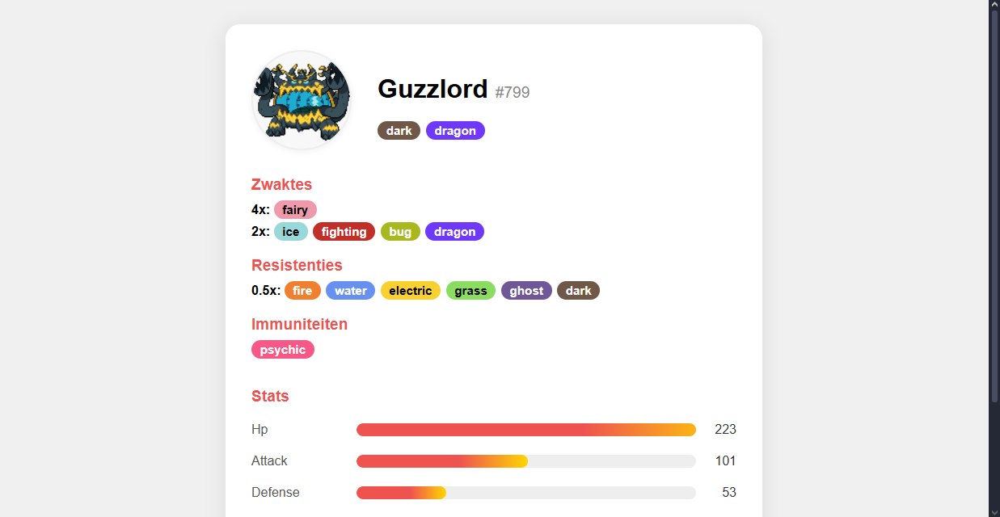

# WebAdvancedPokemonAPI
Opdracht herexamen Web Advanced met gebruik van PokeAPI

# PokéDex SPA – Web Advanced Herexamen

Een interactieve Pokédex Single Page Application (SPA) gebouwd met Vite en de PokéAPI. De app laat gebruikers Pokémon verkennen, filteren, zoeken, sorteren, en favorieten opslaan.

## ⚙️ Installatie

```bash
cd .\WebAdvancedPokemonAPI
npm install
npm run dev
```

## ✨ Features
- Bekijk alle Pokémon uit alle generaties
- Filter op type (meerdere tegelijk, AND-filter)
- Filter op generatie (meerdere tegelijk)
- Zoek op naam
- Sorteer op Pokédex-nummer, naam of type (oplopend/aflopend)
- Favorieten opslaan (lokaal)
- Responsive design
- "Laad meer" knop om extra Pokémon te tonen
- Type-labels met kleur per type
- Duidelijk bericht als er geen resultaten zijn
- Observer API melding onderaan de lijst
- Detailpagina met correcte zwaktes/resistenties voor dual-types

## 📦 Gebruikte technologieën
- [Vite](https://vitejs.dev/) (build tool)
- [PokéAPI](https://pokeapi.co/) (data)
- HTML, CSS, JavaScript (SPA zonder framework)

## 📁 Projectstructuur
- `index.html` – Hoofdpagina
- `src/main.js` – Hoofdlogica (filteren, sorteren, laden)
- `src/infopokemon.html` – Detailpagina
- `src/infopokemon.js` – Logica detailpagina
- `src/style/style.css` – Styling hoofdgrid
- `src/style/infopokemon.css` – Styling detailpagina
- `public/` – Assets (screenshots)

## 📝 Opmerkingen
- De app werkt volledig client-side en gebruikt alleen de PokéAPI.
- Favorieten worden opgeslagen in localStorage.
- Voor performance worden Pokémon in batches geladen met een "Laad meer" knop.
- De detailpagina berekent zwaktes/resistenties correct voor dual-types (zie `src/infopokemon.js`).
- Observer API (IntersectionObserver) toont melding als je onderaan de lijst bent.

## 🛠️ Technische vereisten & implementatie

| Vereiste | Implementatie | Bestand/Lijn |
|---|---|---|
| Pokémon ophalen en tonen | `fetchPokemons()` en `renderPokemonList()` | `src/main.js` |
| Filteren op type (AND) | Checkboxen + filterlogica | `src/main.js` (filterPokemons) |
| Filteren op generatie (meerdere tegelijk) | Checkboxen + filterlogica | `src/main.js` (filterPokemons) |
| Zoeken op naam | Input + filterlogica | `src/main.js` (filterPokemons) |
| Sorteren op nummer, naam, type | Dropdown + sorteerfunctie | `src/main.js` (sortPokemons) |
| Favorieten opslaan | localStorage + toggleFavorite | `src/main.js` (toggleFavorite) |
| Responsive grid | CSS grid | `src/style/style.css` |
| "Laad meer" knop | Soft limit + knop | `src/main.js` (renderPokemonList) |
| Type-labels met kleur | CSS classes | `src/style/style.css` |
| Geen resultaten melding | `renderPokemonList()` + CSS | `src/main.js`, `src/style/style.css` |
| Favorieten tonen | Knop + filter | `src/main.js` |
| Detailpagina met zwaktes/resistenties | `renderPokemonInfo()` | `src/infopokemon.js` |
| Observer API melding | IntersectionObserver | `src/main.js` |

## 🖼️ Screenshots

> Basic overview van de website
>
> 
> Pagina met favorieten
>
> 
> Melding bij foute parameters
>
> 
> Info pagina van pokemon
>
> 


---