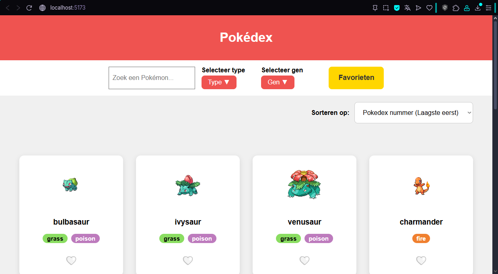
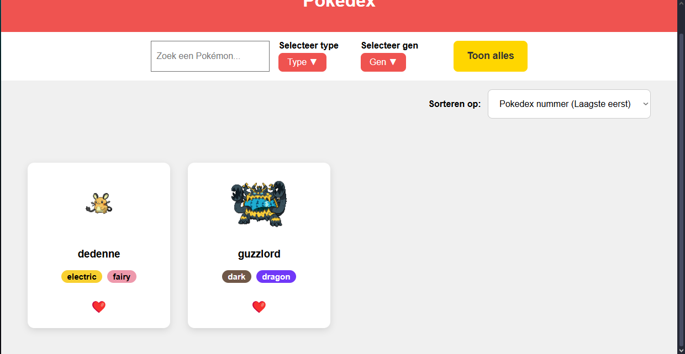
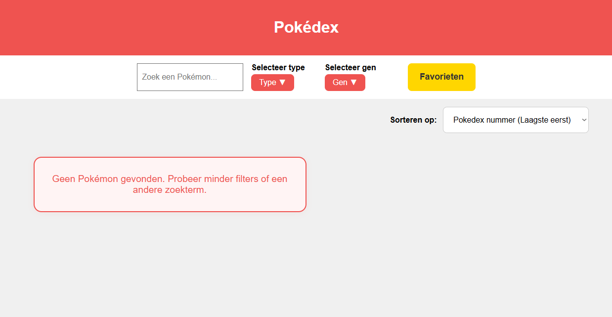

# WebAdvancedPokemonAPI
Opdracht herexamen Web Advanced met gebruik van PokeAPI

# PokéDex SPA – Web Advanced Herexamen

Een interactieve Pokédex Single Page Application (SPA) gebouwd met Vite en de PokéAPI. De app laat gebruikers Pokémon verkennen, filteren, zoeken, sorteren, en favorieten opslaan.

## ⚙️ Installatie

```bash
cd .\WebAdvancedPokemonAPI
npm install
npm run dev
```

## ✨ Features
- Bekijk alle Pokémon uit alle generaties
- Filter op type (meerdere tegelijk, AND-filter)
- Filter op generatie (meerdere tegelijk)
- Zoek op naam
- Sorteer op Pokédex-nummer, naam of type (oplopend/aflopend)
- Favorieten opslaan (lokaal)
- Responsive design
- "Laad meer" knop om extra Pokémon te tonen
- Type-labels met kleur per type
- Duidelijk bericht als er geen resultaten zijn

## 📦 Gebruikte technologieën
- [Vite](https://vitejs.dev/) (build tool)
- [PokéAPI](https://pokeapi.co/) (data)
- HTML, CSS, JavaScript (SPA zonder framework)

## 📁 Projectstructuur
- `index.html` – Hoofdpagina
- `src/main.js` – Hoofdlogica (filteren, sorteren, laden)
- `src/style/style.css` – Styling
- `public/` – Assets

## 📝 Opmerkingen
- De app werkt volledig client-side en gebruikt alleen de PokéAPI.
- Favorieten worden opgeslagen in localStorage.
- Voor performance worden Pokémon in batches geladen met een "Laad meer" knop.

## 🛠️ Technische vereisten & implementatie

| Vereiste | Implementatie | Bestand/Lijn |
|---|---|---|
| Pokémon ophalen en tonen | `fetchPokemons()` en `renderPokemonList()` | `src/main.js` (rond lijn 18, 36) |
| Filteren op type (AND) | Checkboxen + filterlogica | `src/main.js` (filterPokemons, rond lijn 140) |
| Filteren op generatie (meerdere tegelijk) | Checkboxen + filterlogica | `src/main.js` (filterPokemons, rond lijn 146) |
| Zoeken op naam | Input + filterlogica | `src/main.js` (filterPokemons, rond lijn 137) |
| Sorteren op nummer, naam, type | Dropdown + sorteerfunctie | `src/main.js` (sortPokemons, rond lijn 120) |
| Favorieten opslaan | localStorage + toggleFavorite | `src/main.js` (toggleFavorite, rond lijn 100) |
| Responsive grid | CSS grid | `src/style/style.css` (rond lijn 30) |
| "Laad meer" knop | Soft limit + knop | `src/main.js` (renderPokemonList, rond lijn 80) |
| Type-labels met kleur | CSS classes | `src/style/style.css` (rond lijn 180) |
| Geen resultaten melding | `renderPokemonList()` + CSS | `src/main.js` (rond lijn 40), `src/style/style.css` (rond lijn 240) |
| Favorieten tonen | Knop + filter | `src/main.js` (eind van bestand) |

## 🖼️ Screenshots

> Basic overview van de website
>
> 
> Pagina met favorieten
>
> 
> Melding bij foute parameters
>
> 


---